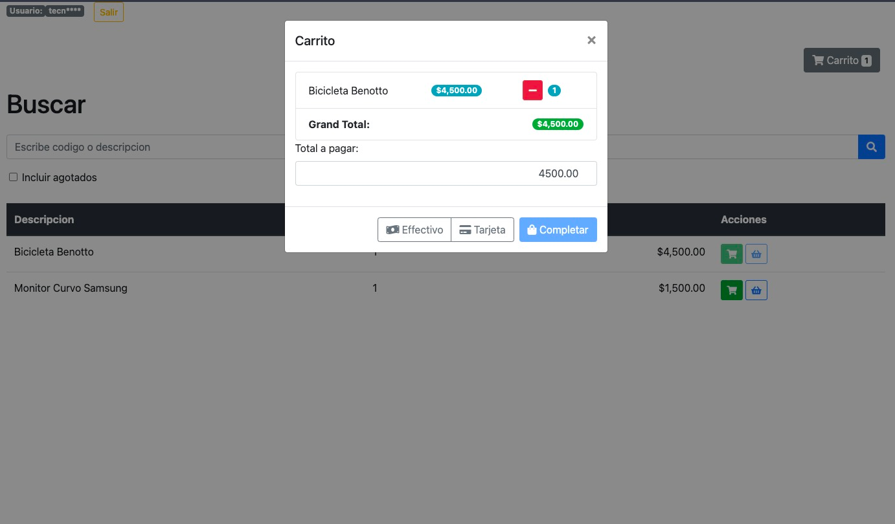

# Basic POS

Basic POS with UI to "sell" products.

## Getting Started

Populate the database with the following command:

```bash
go run ./scripts/import.go -path items-sale.csv
```

The CSV file must have the following format:

```csv
name,qty,price
item,1,200
```

## Run

Run the server with the following command:
```bash
    go run main.go -port 8080
```

## Screenshots

